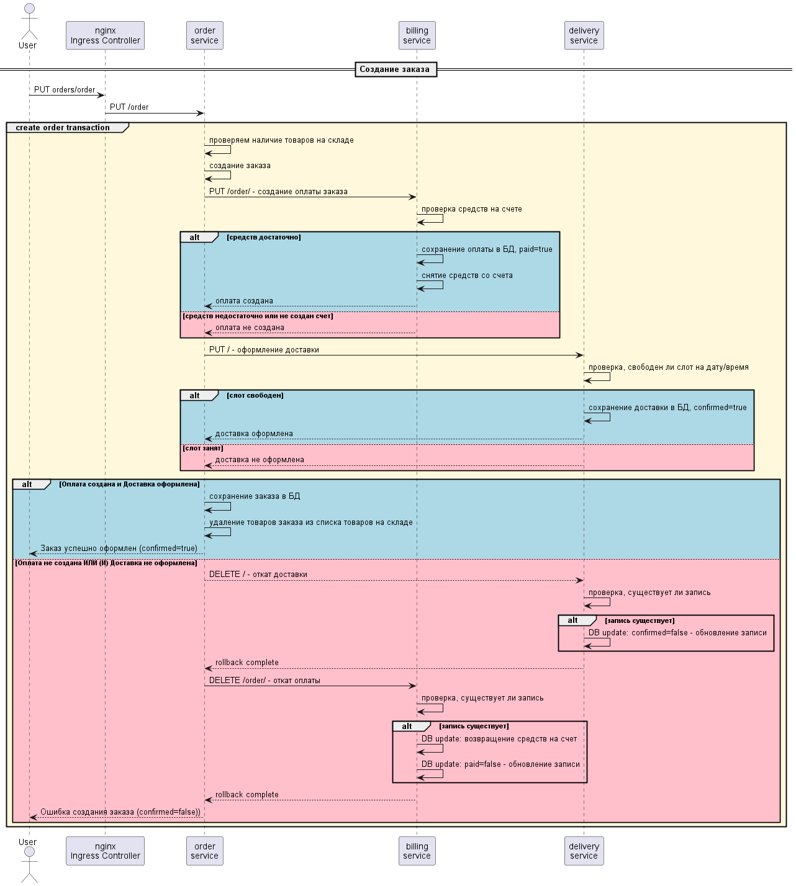

# ms-homework 9 - Saga
### Сервисы приложения
- **auth-service** - сервис авторизации. Хранит UUID пользователей, их пароли и роли. Ответственность - login, signup и проверка аутентификации 
- **app-service** - хранит профиля пользователей, название сложилось исторически
- **order-service** - сервис заказов. Хранит информацию о наличии товаров на складе, их цены и список заказов с их содержимым и статусами. Ответственность - склад, создание заказа.
- **delivery-service** - сервис доставки. Хранит информацию обо всех запрошенных доставках и их статусах. Ответственность - создание сетки заказов и поддержание согласованности заказо по времени
- **billing-service** - сервис оплаты. Хранит информацию о балансе пользователей и об оплатах заказов. Ответственность - пополнение баланса на счету пользователя, оплата заказов со счета пользователя, проедоставление актуальной информации о балансе и статусах оплат.

### Краткое описание взаимодействия сервисов 
При разделении микросервисов предполагаются разные БД, но в задании была использована одна и та же база данных для упрощения. Таблицы разных сервисов не имеют взаимосвязанных constraints и независимы друг от друга. </br> 
Nginx перенаправляет запросы /auth на сервис авторизации, где пользователь может зарегистрироваться /signup и залогиниться /login.  </br>
</br>
Запросы /orders перенаправляются в сервис заказов. Этот сервис принимает запросы с JWT аутентификацией только для зарегистрированных и залогиненых юзеров. Сервис заказов принимает следующие API запросы:
- GET /warehouse - посмотреть наличие товаров на складе.
- PUT /order - создать заказ. В теле запроса необходимо перечислить товары, их количество и указать дату и временной слот доставки. В случае отсутвия необходимой суммы на балансе пользователя или указании таймлота, который уже занят другим заказом происходит откат заказа, оплаты и доставки.
- GET /order/{orderUUID} - посмотреть заказ. Статус заказа возвращается в поле confirmed со значенияма true, если заказ прошел и false, если не прошел.</br>

<p>Запросы /billing перенаправляются на сервис биллинга. Все запросы должны содержать токен аутентификации</p>

- PUT / - добавить денег на счет
- GET /balance - посмотреть сколько денег на счету
- PUT /order - создание оплаты заказа. При наличии необходимой суммы, создается запись в таблице orders c paid=true и со счета списывается необходимая сумма. При отсутвии необходимой суммы записи не создается и происходит откат заказа.
- DELETE /order - откат оплаты заказа. Выставляется paid=false в таблице orders и на баланс возвращаются деньги 
- GET /order - посмотреть оплату заказа. В поле orderStatus будет значение PAID в случае успешного оформления заказа и REJECTED в случае отката ранее оформленного заказа.

<p>Запросы /delivery перенаправляются на сервис доставки. Все запросы должны содержать токен аутентификации</p>

- PUT / - оформление доставки. При наличии свободного слота на дату/время, создается запись в таблице delivery с confirmed=true. При занятом слоте записи не создается и происходит откат заказа.
- DELETE / - откат доставки заказа. Выставляется confirmed=false в таблице delivery для ранее оформленной доставки
- GET / - посмотреть доставку заказа. В поле deliveryStatus будет значение CONFIRMED в случае успешного оформления доставки и REJECTED в случае отката ранее оформленной доставки.

### Упрощенная sequence диаграммf создания заказа на основе паттерна SAGA. 
Проверки авторизации, действия для поддержки идемпотентности и другое, не относящееся напрямую к SAGA, не отображено на диаграммах.


### Краткое описание тестового сценария
- регистрация пользователя
- логин пользователя
- создаем заказ_1 стоимостью 2600 ==> не создан, нет счета
- убеждаемся, что оплата не создана
- убеждаемся, что доставка создана, но не подтверждена (была компенсирующая транзакция)
- убеждаемся, что заказ создан, но не подвержден
- добавляем 5000 на баланс
- создаем заказ_1 (повторный запрос) стоимостью 2600 ==> создан успешно
- убеждаемся, что на балансе осталось 2400
- убеждаемся, что заказ подтвержден
- убеждаемся, что оплата прошла
- убеждаемся, что доставка оформлена
- убеждаемся, что на складе товаров стало меньше на количество в заказе
- создаем заказ_2 (повторный запрос) ==> заказ не создан, не хватает средств и занят слот доствки
- добавляем 5000 на баланс
- на счету 7400
- создаем заказ 3 (новый запросб слот доставки изменен) ==> создан успешно
- убеждаемся, что на балансе осталось 4800
- убеждаемся, что заказ подтвержден
- убеждаемся, что оплата прошла
- убеждаемся, что доставка оформлена
- убеждаемся, что на складе товаров стало меньше на количество в заказе

### Развертывание приложения в кластере
- Команды приведены для кластера minikube (запускался на windows)
- Команды запускаются из директории kubernetes, где лежат файлы манифестов

```bash
minikube start --cpus=4 --memory=12gb --disk-size=8gb
```

#### 1 - Сделаем маппинг arch.homework на IP minikube кластера:
```bash
minikube ip
```
add to hosts: `172.23.222.239 arch.homework`<br/>
<br/>
#### 2 - Добавим HELM репозитории:
[//]: # (helm repo add prometheus-community https://prometheus-community.github.io/helm-charts)
[//]: # (helm repo add stable https://charts.helm.sh/stable)
```bash
helm repo add bitnami https://charts.bitnami.com/bitnami
helm repo add ingress-nginx https://kubernetes.github.io/ingress-nginx
helm repo update
```
#### 3 - Перейдем в директорию kubernetes проекта
```bash
cd <project_dir>/kubernetes
```

[//]: # (#### 4 - Установим kube-prometheus-stack через HELM:)
[//]: # (```bash)
[//]: # (# helm install prom prometheus-community/kube-prometheus-stack -f prometheus.yaml --atomic)
[//]: # (```)

#### 5 - Установим Ingress NGINX через HELM:
```bash
kubectl create namespace m
helm install nginx ingress-nginx/ingress-nginx --namespace m -f nginx-daemon.yaml --atomic
```

#### 6 - Установим PostgreSQL через HELM:
```bash
helm install my-release bitnami/postgresql --set global.postgresql.auth.username=postgres --set global.postgresql.auth.password=pass --set global.postgresql.auth.database=postgres
```

#### 7 - Запускаем манифесты - Config Map, Roles, Deployment и Nginx:
```bash
kubectl apply -f secret.yaml
kubectl apply -f config_map.yaml
kubectl apply -f role-bindings.yaml
kubectl apply -f deployment.yaml
kubectl apply -f nginx-ingress.yaml
```

#### 6 - Из корневой директории newman-ом запускаем postman коллекцию ms-hw-7.postman.json:
Для проверки идемпотентности добавлены следующие сценарии
- Создание заказа с актуальным хешем If-Match
- Повторное создание заказа с тем же хешем, возвращается ранее созданный заказ
- Заказ товара с обновленным актуальным хешем - создается новый заказ
- Заказ товара с неактуальным хешем - будет получена ошибка 412 - что предусмотрено в тестовом сценари - попытка создания заказа с некорректным If-Match
```bash
cd ..
newman run ms-hw-9.postman.json
```
#### (*) Для повторного запуска тестов необходимо почистить БД поскольку таймслоты доставки захардкожены в сценариях и не могут использоваться повторно
- Всем delivery с confirmed=true выставляем confirmed=false (освобождаем таймслоты)
```bash
kubectl port-forward services/my-release-postgresql 5432:5432 -n=default
```
