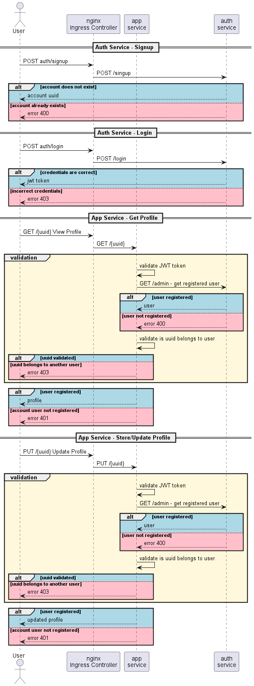

# ms-homework 6 - Apigateway
### Краткое описание взаимодействия сервисов
Приложение разделено на два сервиса - авторизации (auth) и само приложение (app). Также добавлен nginx. Предполагается, что базы данных у сервисов тоже разные, но это не входит в рамки текущего задания, я оставил одну базу. </br> 
Nginx перенаправляет запросы /auth на сервис авторизации, где пользователь может зарегистрироваться /signup или залогиниться /login. При регистрации будет возвращен uuid пользователя, при логине - JWT token.<br/>
Все остальные пользовательские запросы перенаправляются на приложение app, где пользователь может посмотреть свой профайл GET /{uuid} или записать в него данные PUT /{uuid}.</br>
Сервис app проверяет токен и затем отправляет запрос на сервис авторизации для проверки регистрации пользователя. Этот запрос защищен JWT токеном администратора, который занесен в базу данных auth сервиса. В случае успешных проверок сервис app возвращает или записывает профайл.



#### 
- Команды приведены для кластера minikube (запускался на windows)
- Команды запускаются из директории kubernetes, где лежат файлы манифестов

```bash
minikube start --cpus=4 --memory=12gb --disk-size=8gb
```

#### 1 - Сделаем маппинг arch.homework на IP minikube кластера:
```bash
minikube ip
```
add to hosts: `172.23.222.239 arch.homework`<br/>
<br/>
#### 2 - Добавим HELM репозитории:
[//]: # (helm repo add prometheus-community https://prometheus-community.github.io/helm-charts)
[//]: # (helm repo add stable https://charts.helm.sh/stable)
```bash
helm repo add bitnami https://charts.bitnami.com/bitnami
helm repo add ingress-nginx https://kubernetes.github.io/ingress-nginx
helm repo update
```
#### 3 - Перейдем в директорию kubernetes проекта
```bash
cd <project_dir>/kubernetes
```

[//]: # (#### 4 - Установим kube-prometheus-stack через HELM:)
[//]: # (```bash)
[//]: # (# helm install prom prometheus-community/kube-prometheus-stack -f prometheus.yaml --atomic)
[//]: # (```)

#### 5 - Установим Ingress NGINX через HELM:
```bash
kubectl create namespace m
helm install nginx ingress-nginx/ingress-nginx --namespace m -f nginx-daemon.yaml --atomic
```

#### 6 - Установим PostgreSQL через HELM:
```bash
helm install my-release bitnami/postgresql --set global.postgresql.auth.username=postgres --set global.postgresql.auth.password=pass --set global.postgresql.auth.database=postgres
```

#### 7 - Запускаем манифесты - Config Map, Roles, Deployment и Nginx:
```bash
kubectl apply -f secret.yaml
kubectl apply -f config_map.yaml
kubectl apply -f role-bindings.yaml
kubectl apply -f deployment.yaml
kubectl apply -f nginx-ingress.yaml
kubectl apply -f service_monitor.yaml
```

#### 6 - Из корневой директории newman-ом запускаем postman коллекцию ms-hw-6.postman.json:
```bash
cd ..
newman run ms-hw-6.postman.json
```

[//]: # (#### 7 - Проверяем установку прометеус:)
[//]: # (```bash)
[//]: # (```)
[//]: # ($ `kubectl port-forward service/prom-kube-prometheus-stack-prometheus 9090:9090` <br/>)
[//]: # (В Status -> Service Discovery должен быть: `serviceMonitor/default/app-service/0 &#40;3 / 24 active targets&#41;` <br/>)
[//]: # ()
[//]: # (#### 8 - Проверяем установку графаны:)
[//]: # (```bash)
[//]: # (```)
[//]: # ($ `kubectl port-forward service/prom-grafana  3000:80` <br/>)
[//]: # (Логин / пароль: `admin / prom-operator` <br/>)
[//]: # ()
[//]: # (#### 9 - Импортируем дашборд:)
[//]: # (```bash)
[//]: # (```)
[//]: # ($ `./grafana/DASBOARD__RPC_Latency_Errors.json` <br/>)
[//]: # ()
[//]: # (#### 10 - Скриншоты дашбора под нагрузкой и алерты:)
[//]: # (```bash)
[//]: # (```)
[//]: # ($ `./grafana/` <br/>)
